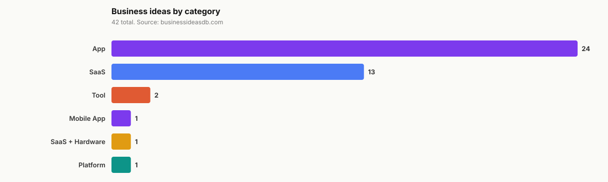
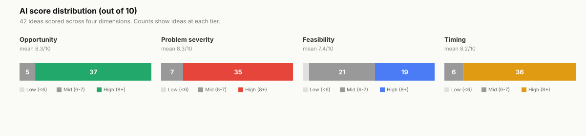

<p align="center">
  
</p>

<h1 align="center">Business Ideas Dataset</h1>

<p align="center">
  <strong>A public, MIT licensed dataset of validated business ideas sourced from real Reddit pain points and App Store reviews, scored by AI across opportunity, problem severity, feasibility, and timing. Comes with a CLI, ready to use AI agent skills, and integration recipes for Claude Code, Codex CLI, Cursor, and any markdown aware system.</strong>
</p>

<p align="center">
  <a href="https://businessideasdb.com?utm_source=github&utm_medium=dataset&utm_campaign=business-ideas-dataset"></a>
  <a href="data/ideas.json"></a>
  <a href="LICENSE"></a>
  <a href="data/ideas.json"></a>
  <a href="cli/"></a>
  <a href="skills/"></a>
</p>

<p align="center">
  <a href="data/ideas.json"><strong>ideas.json</strong></a> &nbsp;·&nbsp;
  <a href="data/ideas.csv"><strong>ideas.csv</strong></a> &nbsp;·&nbsp;
  <a href="cli/"><strong>CLI</strong></a> &nbsp;·&nbsp;
  <a href="skills/"><strong>Skills</strong></a> &nbsp;·&nbsp;
  <a href="INTEGRATIONS.md"><strong>Integrations</strong></a> &nbsp;·&nbsp;
  <a href="METHODOLOGY.md"><strong>Methodology</strong></a> &nbsp;·&nbsp;
  <a href="https://businessideasdb.com/state-of-indie-business-ideas-2026?utm_source=github&utm_medium=dataset&utm_campaign=business-ideas-dataset"><strong>2026 Report</strong></a>
</p>

---

## What this is

A public, machine readable dataset of business ideas that have already passed a validation filter. Every idea in `data/ideas.json` started as a real complaint on Reddit (someone asking for a tool that does not exist yet, or describing a workflow they hate) or a pattern of negative reviews on a popular App Store app. Each idea is enriched with:

1. The underlying keyword and its monthly search volume in the US
2. Year over year search growth
3. Four AI scores from 0 to 10 (opportunity, problem severity, feasibility, timing)
4. Competition level, difficulty, revenue range estimate
5. A direct link back to the full editorial analysis at [businessideasdb.com](https://businessideasdb.com?utm_source=github&utm_medium=dataset&utm_campaign=business-ideas-dataset)

If you build, invest in, or write about indie SaaS, micro SaaS, mobile apps, or small business ideas, this is a citable source of demand evidence. The full editorial analysis (customer profile, MVP feature list, Reddit thread URLs, competitor research) lives on the site.

## Three ways to use it

### 1. Raw data

```bash
# JSON
curl -sL https://raw.githubusercontent.com/theomarsoliman/business-ideas-dataset/main/data/ideas.json

# CSV
curl -sL https://raw.githubusercontent.com/theomarsoliman/business-ideas-dataset/main/data/ideas.csv
```

### 2. CLI tool

```bash
# Install (one line, no deps)
curl -sL https://raw.githubusercontent.com/theomarsoliman/business-ideas-dataset/main/cli/bid.py \
  -o ~/.local/bin/bid && chmod +x ~/.local/bin/bid

# Use
bid stats
bid list --category SaaS --min-feas 8 --limit 5
bid get trade-invoice-autopilot
bid search "invoice"
bid top-growth
```

See [`cli/README.md`](cli/README.md) for full options.

### 3. AI agent skills

Six portable skill files for Claude Code, Codex CLI, Cursor, or any markdown aware agent. Drop them in your skill directory and the agent will use the dataset automatically when the user asks about business ideas.

| Skill | What it does |
|---|---|
| [validate-idea](skills/validate-idea.md) | Score a user's idea against the BID rubric |
| [find-saas-wedge](skills/find-saas-wedge.md) | Surface validated opportunities in a niche |
| [mvp-build-plan](skills/mvp-build-plan.md) | Produce a 2 to 4 week day by day build plan |
| [reddit-pain-finder](skills/reddit-pain-finder.md) | Walk the BID 170 query pattern Reddit scan |
| [competitor-mapping](skills/competitor-mapping.md) | Map direct, adjacent, and indirect competitors |
| [keyword-demand-check](skills/keyword-demand-check.md) | Validate buyer intent via search volume |

See [`INTEGRATIONS.md`](INTEGRATIONS.md) for the install recipe for your specific agent (Claude Code, Codex CLI, Cursor, Cline, Continue, Aider, MCP, generic).

## What is in the data

<p align="center">
  
</p>

42 ideas across 6 categories at last export. Categories include SaaS (B2B and B2C), App and Mobile App (consumer and prosumer), Tool (single purpose utilities), Platform (multi sided), and a small SaaS plus Hardware bucket.

<p align="center">
  
</p>

Scores skew toward 7 and above on at least one dimension because the dataset is filtered for that on entry. Median feasibility is in the 7 to 9 range, meaning most ideas can ship as an MVP in 2 to 4 weeks for a solo founder using the modern AI assisted stack.

## Quick examples

```bash
# Highest opportunity scoring SaaS ideas
curl -sL https://raw.githubusercontent.com/theomarsoliman/business-ideas-dataset/main/data/ideas.json \
  | jq '.ideas | map(select(.category == "SaaS")) | sort_by(-.opportunity_score) | .[0:5] | .[] | {title, opportunity_score, url}'
```

```python
import json, urllib.request
data = json.load(urllib.request.urlopen("https://raw.githubusercontent.com/theomarsoliman/business-ideas-dataset/main/data/ideas.json"))
top_growth = sorted(
    [i for i in data["ideas"] if i["growth_percent"]],
    key=lambda i: -i["growth_percent"],
)[:10]
for i in top_growth:
    print(f"{i['growth_percent']:+}% {i['title']} ({i['category']})")
    print(f"   {i['url']}")
```

## Schema

Each entry in `data/ideas.json` under the `ideas` array has these fields:

| Field | Type | Description |
|---|---|---|
| `id` | number | Internal ID, stable across exports |
| `slug` | string | URL slug, matches the BID URL |
| `title` | string | Short descriptive title of the idea |
| `pitch` | string | One sentence summary, includes hard numbers where known |
| `category` | string | One of: SaaS, App, Mobile App, Tool, Platform, SaaS + Hardware |
| `tags` | string[] | Topic tags, lowercase |
| `keyword` | string | Primary keyword used for demand validation |
| `search_volume` | number | US monthly search volume (DataForSEO) |
| `growth_percent` | number | YoY change in search volume |
| `competition` | string | Low, Medium, or High |
| `difficulty` | string | Easy, Medium, or Hard build complexity |
| `revenue_range` | string | Estimated revenue range, e.g. "$10K to $50K" |
| `opportunity_score` | 0 to 10 | Market potential and competitive gap |
| `problem_score` | 0 to 10 | Severity of the user pain |
| `feasibility_score` | 0 to 10 | How easy the MVP is for a small team |
| `timing_score` | 0 to 10 | Whether the market window is open now |
| `signal_count` | number | Count of supporting Reddit threads (URLs and bodies live on site) |
| `competitor_names` | string[] | Named existing competitors (no URLs) |
| `created_at` | string | When the idea entered the dataset |
| `updated_at` | string | Last edit timestamp |
| `url` | string | Canonical URL for the full editorial analysis (clean, no UTMs) |
| `tracked_url` | string | Same URL with UTM parameters for attribution |

See [data/README.md](data/README.md) for example queries and field semantics.

## Methodology

See [METHODOLOGY.md](METHODOLOGY.md) for the full scoring rubric, source pipeline, and validation criteria. Short version:

1. A scanner pulls posts from 5 or more subreddits (r/SaaS, r/SmallBusiness, r/Entrepreneur, r/IndieHackers, r/SideProject, plus category specific subs) against 170 query patterns
2. The iTunes App Store API surfaces apps with high install counts and clustered negative reviews
3. Each candidate signal is scored by an AI rubric (Grok 3 mini) across the four dimensions
4. Signals scoring 7 or higher on at least one dimension move into the editorial review queue
5. Editorial review enriches with DataForSEO keyword data, competitor mapping, and the long form analysis published at businessideasdb.com

## Examples

* [Top 10 ideas by opportunity score](examples/top-by-opportunity.md)
* [Highest growth keywords (YoY)](examples/top-by-growth.md)
* [SaaS only subset](examples/saas-ideas.md)
* [App and Mobile App subset](examples/app-ideas.md)
* [Highest feasibility for solo founders](examples/high-feasibility.md)

## Use cases

| Who | What this gives you |
|---|---|
| Indie founders looking for a wedge | A pre filtered list of validated ideas with the search demand attached |
| Investors and angels | A demand signal layer for early stage opportunity sourcing |
| AI agent builders | A structured dataset plus 6 skills you can drop into Claude Code, Codex, Cursor |
| Researchers and writers | A citable, dated public dataset for posts about indie business trends |
| LLM and AI search products | Structured data with stable URLs you can reference in answers |

## Attribution

This dataset stamps UTM parameters on links back to businessideasdb.com so the live site can track which surface (README, CLI, specific skill) drove which click. The `url` field stays canonical for citation purposes. The `tracked_url` field has the UTM appended.

If you fork the CLI or skills, please keep the UTM template intact (change `utm_medium` to match your context). Removing attribution does not break anything but it cuts the signal loop that lets the dataset improve.

## Citation

If you use this dataset in a post, paper, or product, please cite the live source:

```
Business Ideas Database (2026). Validated Business Ideas Dataset.
Retrieved from https://businessideasdb.com/state-of-indie-business-ideas-2026
```

Each individual idea can be cited by its `url` field, which points to the canonical editorial analysis on businessideasdb.com.

## License

[MIT](LICENSE). Use, modify, redistribute, build on top of. Attribution back to [businessideasdb.com](https://businessideasdb.com?utm_source=github&utm_medium=dataset&utm_campaign=business-ideas-dataset) is appreciated but not required.

## Related

* **[State of Indie Business Ideas 2026](https://businessideasdb.com/state-of-indie-business-ideas-2026?utm_source=github&utm_medium=dataset&utm_campaign=business-ideas-dataset)**, annual data report with full aggregates
* **[SaaS Ideas](https://businessideasdb.com/saas-ideas?utm_source=github&utm_medium=dataset&utm_campaign=business-ideas-dataset)**, filtered SaaS subset with editorial commentary
* **[Micro SaaS Ideas](https://businessideasdb.com/micro-saas-ideas?utm_source=github&utm_medium=dataset&utm_campaign=business-ideas-dataset)**, solo founder filtered subset (feasibility 7 or higher)
* **[App Ideas](https://businessideasdb.com/app-ideas?utm_source=github&utm_medium=dataset&utm_campaign=business-ideas-dataset)**, mobile app subset with App Store gap analysis
* **[Home Business Ideas](https://businessideasdb.com/home-business-ideas?utm_source=github&utm_medium=dataset&utm_campaign=business-ideas-dataset)**, digital business subset for laptop only operators
* **[Low Cost Business Ideas](https://businessideasdb.com/low-cost-business-ideas?utm_source=github&utm_medium=dataset&utm_campaign=business-ideas-dataset)**, business ideas startable under $1,000
* **[Full database](https://businessideasdb.com/ideas?utm_source=github&utm_medium=dataset&utm_campaign=business-ideas-dataset)**, every idea with the long form analysis
